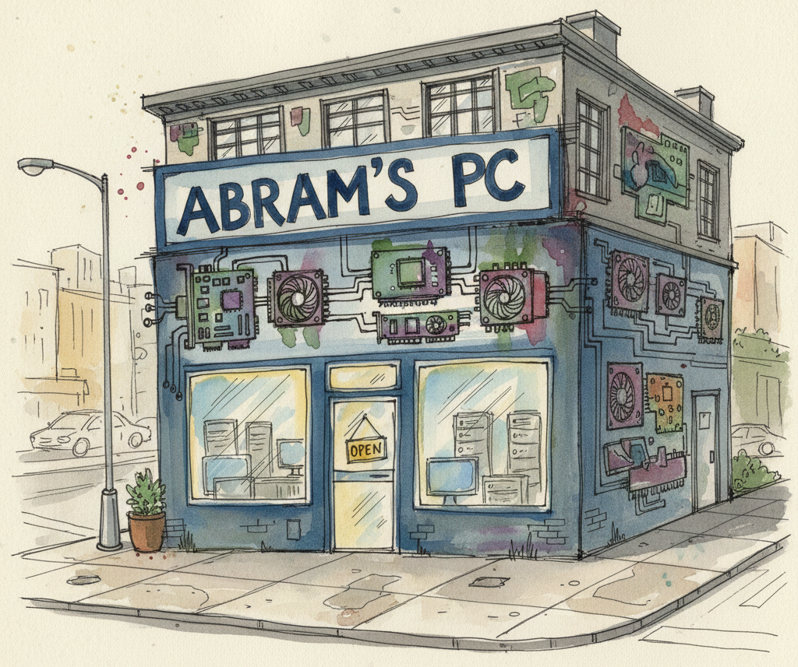

Mr. Abrams has run Abram's PC, a beloved mom-and-pop computer parts store, for years. But with demand exploding and operations spiraling beyond what one person can manage, he jumps at an offer he can't refuse: a complete inventory buyout from the Microcenter down the road, for a pretty penny.
 
 

But now, Microcenter has a problem. Mr. Abram's records are structured but messy and they need to merge their inventory schema with that of Abram's PC's. There are many issues that can arise here, but a particularly interesting one is Entity Resolution (ER). This problem asks how, given two tables of data, we can merge them s.t. there is no more than one row in the merged schema corresponding to each real world entity. 
 
 

The classical ER framework consists of a *blocking* step, where similar rows are grouped into blocks based on shared attributes, and then *matching*, where individual rows are compared to determine matches. And thus, we arrive at our problem of interest, Entity Matching. 
 
 

In our work, we formalize the problem simply; A binary classification with two tuple inputs. 
 
 

Let $r_i \in R$ and $s_j \in S$ be tuples from relations $R$ and $S$ respectively. Entity Matching is the task of learning $f$ s.t:

$$f(r_i, s_j) = \begin{cases} 1 & \text{if } r_i \text{ and } s_j \text{ refer to the same real-world entity} \\ 0 & \text{otherwise} \end{cases}$$

Coming back to **A**bram's PC's and **M**icrocenter,

For example, 

| source | id | brand | title | price | currency |
|--------|-----|-------|-------|-------|----------|
| Microcenter | 36868284 | Crucial | Crucial Memory 4GB DDR3L 1600 1.35V SODIMM Retail CT51264BF160BJ | 64.99 | CAD |
| Abram's PC | 13674019 | Crucial | Crucial 4GB DDR3 1600 MT/S (PC3-12800) CL11 SODIMM 204PIN 1.35V/1.5V Laptop Memory Kit | 0.00 | GBP |

This example takes some liberties. In reality, it is unlikely that the two stores would have the same schema structure, but even without this dimension, this problem is non-trivial.
 
 

The classical approach is to train a binary classifier, rule-based first, then traditional ML, and more recently fine-tuned language models like BERT. These work well when labeled data is available. The problem is that labeling entity pairs is expensive, slow, and domain-specific. Fresh labels for Microcenter's inventory, fresh labels for a citation database, fresh labels for a healthcare records system. It doesn't scale.
 
 

Our question was simpler: can we just ask an LLM, zero-shot? And if so, what's the best way to ask?
 
 

Just prompting the model with both records and asking whether they match actually performs reasonably well. But we had a hypothesis. In the explainable EM literature, matching decisions tend to be grounded in specific token-level evidence and attribute importance. A human resolving the Microcenter/Abram's pair above would reason: the model numbers align despite different formatting, the memory spec is the same, the price discrepancy is probably a currency and age artifact. Match.
 
 

That structured reasoning aligns naturally with Chain-of-Thought (CoT) prompting. We designed a three-step framework around it: first, ask the LLM to identify matched and unmatched tokens between the two records; second, ask it to identify which attributes are most influential for the matching decision; finally, ask it to make the call. We implemented this two ways, a single prompt encapsulating all three steps, and a chained multi-prompt approach where each step's output feeds into the next.
 
 

We also explored a debate-based method, where the LLM constructs arguments for and against a match before synthesizing a judgment. The intuition was that explicitly surfacing contradictions would produce more robust decisions. It did not. For a focused binary classification task, prompting the model to generate reasons to reject a match actively misleads it.
 
 

Across six benchmarks spanning product listings, academic citations, and e-commerce data, the reasoning-based methods outperformed the naive baseline in 4 out of 6 tasks under zero-shot settings. The gains were most pronounced on noisier, more ambiguous datasets where shallow pattern matching struggles. On cleaner datasets like DBLP-ACM, the baseline was already strong enough that the additional reasoning bought little.
 
 

Few-shot is a different picture. When the model has a couple of labeled examples to anchor on, the benefit of the reasoning framework shrinks considerably. The CoT scaffolding matters most when the model has nothing else to go on.
 
 

The catch is cost. The multi-prompt approach uses roughly 8 to 10 times more tokens than the baseline, since each step requires its own input and output cycle. Whether that tradeoff is worth it depends on the setting. For high-stakes deduplication where a false match has real downstream consequences, probably yes. For routine cleaning at scale, less so.
 
 

The broader implication: LLMs, with careful prompting, can approach or match fine-tuned classifiers on tasks those classifiers were specifically trained for, zero-shot. The reasoning strategies explored here are preliminary, but they point toward a more principled way of getting there.

